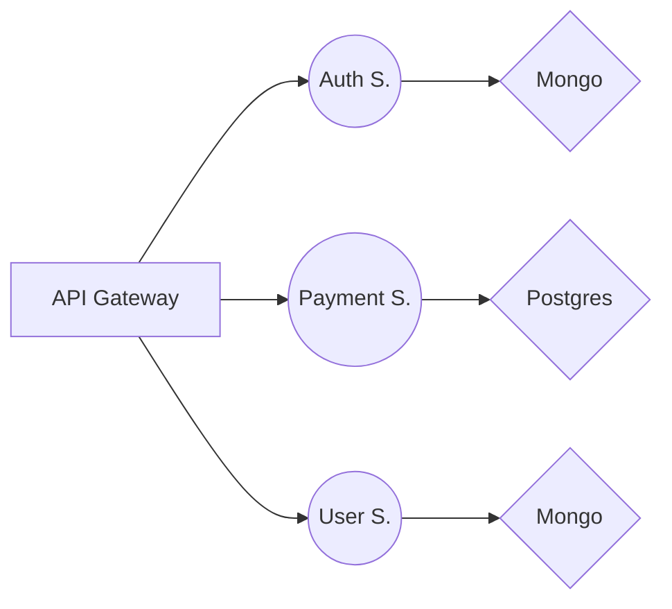

# About

This project is a serious playground, aka 'learning by doing' but trying to do better. Here i'm trying to get closer to **Microservices**, **Databases proffecient level**, **DevOps**.
This project is a set of 3 microservices, in the end result should be something alike:

---

**_Auth Service_**:
| Unit | Technology |
|--|--|
| Core | Fastify |
| DB | Mongo |
| ORM | Mongoose |
| Language | TypeScript |

---

**_Payment Service_**
| Unit | Technology |
|--|--|
| Core | Pure Node.js |
| DB | Postgres |
| ORM | Pure SQL |
| Language | TypeScript |

---

**_User Service_**
--- In progress ---

---

**_P.S_**
This is only a prototype, and I have no idea what I'm doing, so it will be **updated!**

# P.S

This is only a prototype, and I have no idea what I'm doing, so it will be **updated!**
