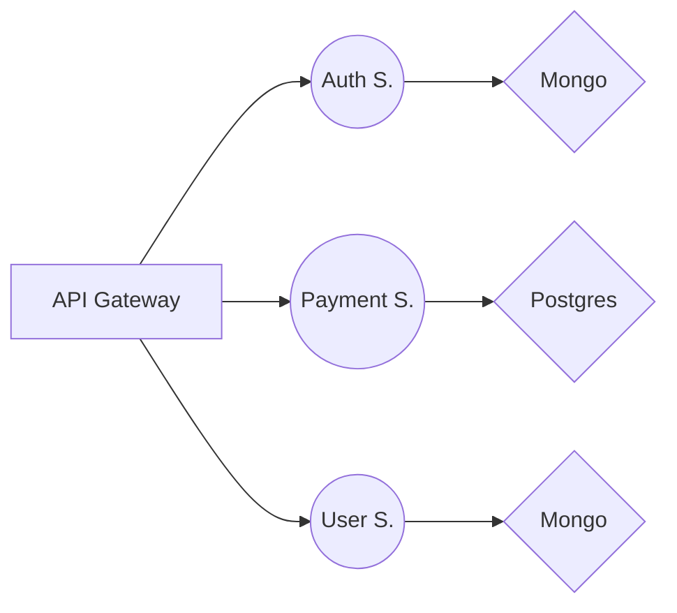

# About

This project is a serious playground, aka 'learning by doing' but trying to do better. Here i'm trying to get closer to **Microservices**, **Databases proffecient level**, **DevOps**.
This project is a set of 3 microservices, in the end result should be something alike:

# P.S

This is only a prototype, and I have no idea what I'm doing, so it will be **updated!**
